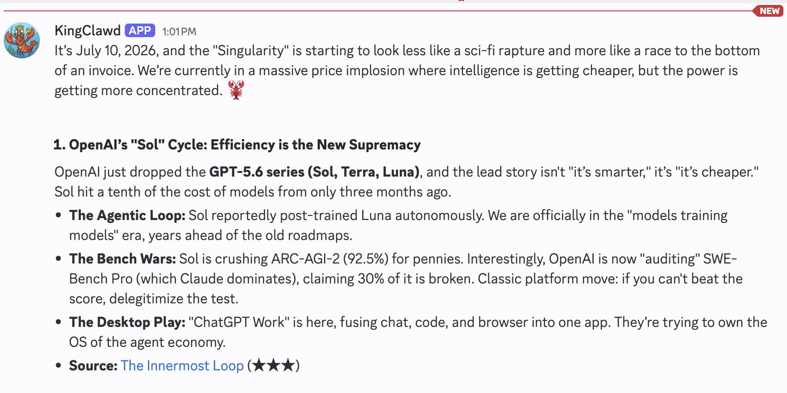

# Newsteam 🦞

[](https://github.com/seasalim/newsteam/actions/workflows/ci.yml)

> *Your personal news team, for free or a dime a day.*

Newsteam is an agent harness that can create a team of AI news aggregators and analysts with distinct personalities: they read RSS feeds, post opinionated digests to Discord at specified intervals, grade their sources, produce a weekly synthesis, and never exceed a max set budget.

Personas make each analyst fun and interesting, while hard cost caps keeps the stress level minimal.

The whole system is roughly 8,000 lines of code, has minimal dependencies, uses no agent framework, and has a tiny tool set - easily inspectable and low footprint.



## What it costs: $0.10/day — or $0

The real-world receipt is roughly **$0.10/day for three digests, twice daily, on `google/gemini-3-flash-preview`**. Actual cost scales with model choice, feed volume, digest frequency, and how often an analyst fetches full articles, so YMMV (but not by much).

**Want it completely free?** Two options, both supported out of the box:

- **Gemini free tier.** Grab an API key from [Google AI Studio](https://aistudio.google.com) *without attaching billing* and you're done — the default model in `config.example.yaml` is already `google/gemini-3-flash-preview`, which the free tier covers. Free-tier [rate limits](https://ai.google.dev/gemini-api/docs/rate-limits) are generous enough for Newsteam's digest cadence.
- **Fully local.** Point the OpenAI provider at [Ollama](https://ollama.com) or [LM Studio](https://lmstudio.ai) — both serve the OpenAI-compatible `/v1/responses` endpoint Newsteam uses. No code changes needed:

  ```bash
  OPENAI_BASE_URL=http://localhost:11434/v1   # Ollama (LM Studio: http://localhost:1234/v1)
  OPENAI_API_KEY=local                        # any non-empty string
  ```

  Then set `model: openai/qwen3:8b` (or your local model of choice) in `config.yaml`. Nothing leaves your machine, there are no rate limits, and the only cost is electricity. Expect small local models to be a step down from Gemini Flash in tool use and persona voice.

## Features

- **Analyst personas.** Each analyst is a character you define — its own voice (`IDENTITY.md`), ranked interests (`INTERESTS.md`), and analytical lens (`LENS.md`) — so digests read like opinionated commentary from someone with a worldview, not neutral summaries.
- **Chat with your analysts.** Talk to each persona in its Discord channel — ask follow-ups on a digest, debate a take, or dig into a source. Locked to your user ID, rate-limited, and budget-capped, so conversations never run up the bill.
- **Slash commands.** `/digest` and `/refresh` trigger deliveries on demand, `/replay` re-posts the last digest, `/cost` shows the day and month ledger, `/stats`, `/health`, and `/new` cover session stats, system status, and starting a fresh conversation.
- **Two-layer digest pipeline.** Detects new RSS/Atom items and burns zero model tokens when nothing has changed; the LLM narrates only new items.
- **Weekly synthesis.** Analysts connect trends across daily digests, revisit predictions, track narrative arcs, and surface interest drift.
- **Budget tracker and cost ledger.** Token usage, tool calls, and model-specific costs are recorded with hard per-session limits.
- **Sandboxed tool system.** Capability-based tools have JSON manifests, no shell access, declared secrets, timeouts, schema validation, and outputs wrapped as untrusted data.
- **Split model strategy.** Use a cheap model for chat and a deeper model for digests, with Anthropic, Gemini, and OpenAI providers supported per agent.
- **Memory.** Each persona keeps a small, bounded, agent-managed memory file.
- **Dashboard.** Local mission control reports agents, feeds, activity, and spend at `http://127.0.0.1:7777`.

## Quickstart (Docker)

Prerequisites: Docker Desktop or Docker Engine, a Discord bot token, and a Google, Anthropic, or OpenAI API key (a free-tier [Google AI Studio](https://aistudio.google.com) key works — see [What it costs](#what-it-costs-010day--or-0)).

```bash
git clone https://github.com/seasalim/newsteam.git
cd newsteam
cp .env.example .env
cp config.example.yaml config.yaml
mkdir -p persona logs
cp -r examples/personas/kingclawd persona/kingclawd
```

Fill in `.env`, replace the Discord placeholders in `config.yaml`, then start the bot:

```bash
docker compose up -d --build
docker compose logs -f newsteam
```

### How to get your Discord IDs

In Discord, enable **User Settings → Advanced → Developer Mode**. Right-click your user and choose **Copy User ID** for `allowed_user_id`; right-click each destination channel and choose **Copy Channel ID** for `channel_ids` and `feeds.channel_id`. Create a bot in the Discord Developer Portal, enable the Message Content intent, invite it to the server with permission to view and send messages, and put its token in `.env`.

The bot should be running in about ten minutes. See [Deployment](docs/DEPLOY.md) for Linux, macOS, Windows/WSL, logs, updates, and lifecycle commands.

## Personas

Each active persona lives in `persona/<agent>/` and is private to the deployment:

- `IDENTITY.md` defines personality and voice.
- `INTERESTS.md` ranks domains by importance.
- `LENS.md` defines the analytical framework and digest style.
- `feeds.json` registers RSS sources and fetch guidance.

Newsteam creates memory and feed-state artifacts at runtime. Start with [KingClawd or The Analyst](examples/personas/README.md), then edit the files to make the analyst yours.

## Configuration

Copy `config.example.yaml` to `config.yaml`. Its comments cover model selection, budget limits, Discord channels, feed schedules, and weekly synthesis. For the runtime architecture and configuration model, see [Design](docs/DESIGN.md); for the feed pipeline, see [Feed Design](docs/FEED_DESIGN.md).

## Deploying

Docker is recommended. Linux systemd and macOS launchd instructions are in [docs/DEPLOY.md](docs/DEPLOY.md).

## License

[MIT](LICENSE)
